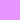
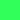

# GalaxyTheme+ 

Dark theme with non-cloying colors inspired by nebula colors.

# Palette Colors

| Colors         | Hexadecimal | Preview                                                     |
| -------------- | ---------   | ------------------------------------------------------------|
| Details        |  `#5352ED`  |             |
| Background     |  `#202024`  |                |
| Numeric        |  `#ffffff`  |                      |
| String         |  `#FFDE59`  |                        |
| Comment        |  `#53CFFF`  |                      |
| Function       |  `#E796FF`  |                    |
| Blue           |  `#53CFFF`  |                            |
| Pink           |  `#FB2189`  |                            |
| Orange         |  `#FF9435`  |                        |
| Green          |  `#53CFFF`  |                          |
