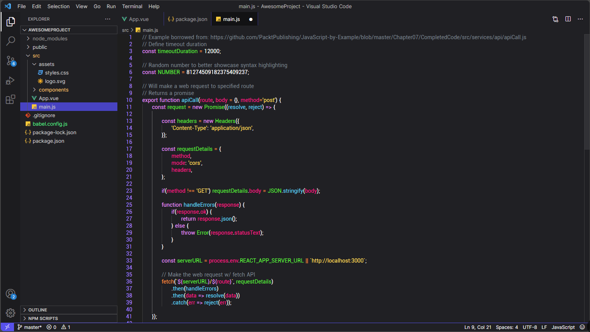
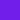
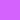
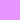
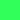

# Galaxy+ Theme 

Dark theme for [Visual Studio Code](https://code.visualstudio.com) with friendly and non-cloying colors inspired by the colors of the universe.

## Install
  You can install from the link to Marketplace: [Galaxy+ Theme](https://marketplace.visualstudio.com/items?itemName=JoaoBatistaJr.GalaxyTheme)

## Color Palette

| UI             | Hex         | RGB           | HSL             | Preview                                            |
| -------------- | ----------- | ------------- | --------------- |--------------------------------------------------- |
| Base Color     |  `#5352ED`  | `83 82 237`   | `240° 81% 63%`  |          |
| Background     |  `#202024`  | `32 32 36`    | `240° 6% 13%`   |        |
| ProgressBar    |  `#C00E9C`  | `192 14 156`  | `312° 86% 40%`  |      |
| FocusBorder    |  `#36B4FF`  | `54 180 255`  | `202° 100% 61%` |      |
| ScrollBar      |  `#711EEA`  | `113 30 234`  | `264° 83% 52%`  |          |
| ListHighlight  |  `#D462FD`  | `212 98 253`  | `284° 97% 69%`  |  |
| TextLink       |  `#FF3F75`  | `255 63 117`  | `343° 100% 62%` |            |

| Syntax         | Hex         | RGB           | HSL             | Preview                                            |
| -------------- | ----------- | ------------- |---------------- |--------------------------------------------------- |
| Numbers        |  `#FFFFFF`  | `255 255 255` | `0° 0% 100%`    |              |
| KeyWorks       |  `#E796FF`  | `231 150 255` | `283° 100% 79%` |            |
| Strings        |  `#FFDE59`  | `255 222 89`  | `220° 6% 53%`   |              |
| Comments       |  `#7F848E`  | `127 132 142` | `48° 100% 67%`  |            |
| Variables      |  `#FB2189`  | `251 33 137`  | `331° 96% 56%`  |          |
| Functions      |  `#5ED1F5`  | `94 209 245`  | `194° 88% 66%`  |          |
| Classes        |  `#33FF5C`  | `51 255 92`   | `132° 100% 60%` |              |
| Operators      |  `#FF9435`  | `255 148 53`  | `28° 100% 60%`  |            |

## Contribution
Feel free to contribute by adding galaxy+ Theme to your favorite editor.

## Credits

The galaxy+ theme was created using [Yo Code](https://vscode-docs.readthedocs.io/en/stable/tools/yocode/), with the help of [Themes VSCode One](https://themes.vscode.one). And also using [Dracula Theme](https://github.com/dracula) as inspiration.

## License
[MIT License](./LICENSE) © Galaxy+ Theme